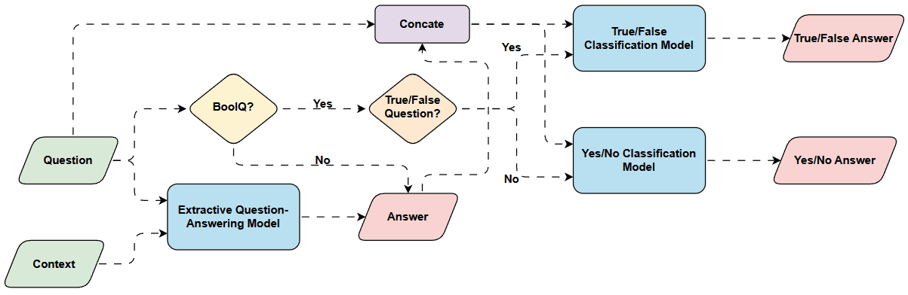
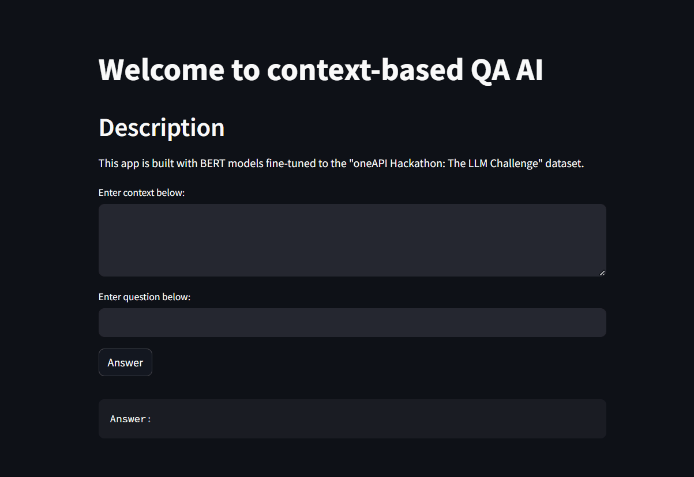

# Intel OneAPI - LLM

This project is a showcase to a solution for "[oneAPI Hackathon: The LLM Challenge](https://machinehack.com/hackathons/intel_oneapi_hackathon_the_llm_challenge/overview)" using BERT models from Hugging Face.

## 💾 Dataset

The dataset for this challenge can be accessed from [here](https://machinehack.com/hackathons/intel_oneapi_hackathon_the_llm_challenge/data).
## 📚 Content

* Jupyter Notebooks
* Web app code
## ⚙️ Models

The models can be accessed from Hugging Face -

* [Extractive QA model](https://huggingface.co/WaRKiD/bert-large-uncased-whole-word-masking-finetuned-intel-oneapi-llm-dataset)
* [Yes/No QA model](https://huggingface.co/WaRKiD/distilbert-base-uncased-finetuned-intel-llm-yn-dataset)
* [True/False QA model](https://huggingface.co/WaRKiD/distilbert-base-uncased-finetuned-intel-llm-tf-dataset)
## 💻 System info

The Jupyter notebooks are excuted on [Intel® Developer Cloud](https://www.intel.com/content/www/us/en/developer/tools/devcloud/services.html) (Intel Xeon CPU with single Intel Max 1100 GPU) using tensorflow_xpu environment.
## Demo

### Note

To get True/False answer on the web app, the question needs to be tagged with the prefix "true or false:".
## 🔗 Links

